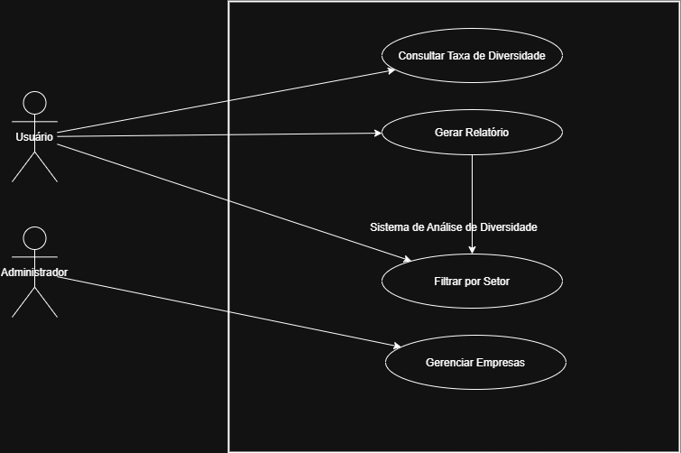

# Engenharia-de-Software---G1-T1
# Definição do Problema e Planejamento Inicial

## 1. Introdução
O projeto consiste no desenvolvimento de um sistema web integrado a uma API para gerar relatórios automáticos sobre empresas e setores de atividade. Esses relatórios visam visualizar a distribuição de funcionários em uma empresa por genêro e por setor, em quantidade e porcentagem, exibirá também a média de idade para entender o perfil desses funcionários. O sistema permite a coleta, processamento e apresentação de informações de maneira organizada e acessível.

## 2. Problema a Ser Resolvido
Empresas frequentemente necessitam gerar relatórios de dados sobre sua estrutura interna, distribução de funcionários e outros indicadores. O processo manual para obter essas informações pode ser demorado e propenso a erros. A solução proposta visa automatizar esse processo, garantindo rapidez, precisão e facilidade de uso.
O problema a ser resolvido foi escolhido no site do ODS (Os Objetivos de Desenvolvimento Sustentável no Brasil) tema Igualdade de gênero.

## 3. Objetivo
Criar uma plataforma que permita a entrada de dados sobre empresas e seus setores, processando as informações automaticamente para gerar relatórios em PDF. O projeto visa fornecer uma ferramenta simples, segura e confiável para gestão e análise empresarial.
Objetivo principal visando o ODS: Um site de consultas de oportunidades de gênero dentro de empresas.

## 4. Solução Proposta
A solução será implementada como um sistema web composto por:
- **API**: Responsável por receber e processar dados das empresas.
- **Interface Web**: Permite interação do usuário para inserção e visualização dos relatórios.
- **Gerador de Relatórios**: Transforma os dados processados em arquivos PDF estruturados.

## 5. Requisitos

### 5.1 Requisitos Funcionais
- O sistema deve permitir a inserção de empresas com CNPJ, endereço e setor de atividade.
- O usuário deve conseguir visualizar e filtrar empresas cadastradas.
- O sistema deve calcular estatísticas por setor, incluindo:
  - Total de funcionários
  - Distribuição por gênero
  - Idade média por gênero
- Os relatórios devem ser gerados automaticamente em formato PDF.

### 5.2 Requisitos Não Funcionais
- A interface web deve ser responsiva.
- A API deve utilizar um banco de dados para armazenar informações.
- O sistema deve garantir tempo de resposta adequado para consulta e geração de relatórios.
- A implementação deve seguir boas práticas de segurança e desenvolvimento.

**Atores:**
- **Usuário:** Insere dados das empresas e solicita relatórios.
- **Adiministrador:** Processa os dados e gera os relatórios.

**Casos de Uso:**
1. Cadastrar nova empresa
2. Visualizar lista de empresas
3. Filtrar empresas por setor
4. Gerar relatório PDF

